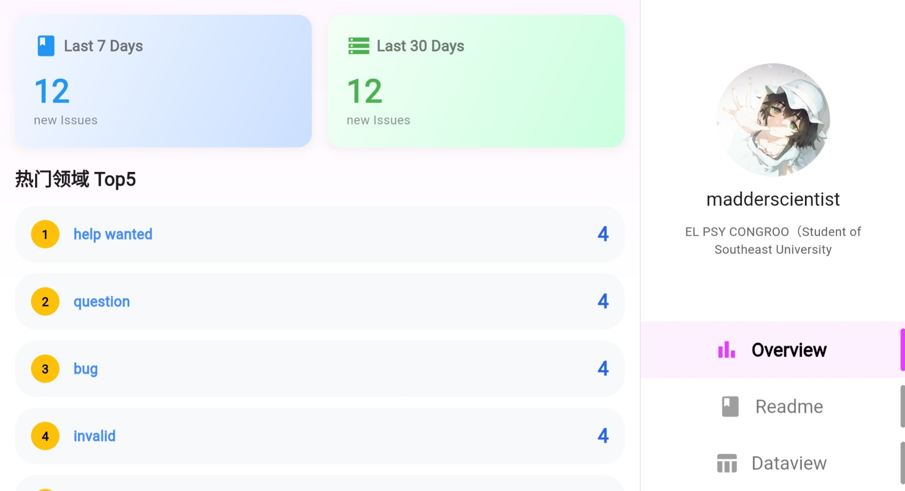
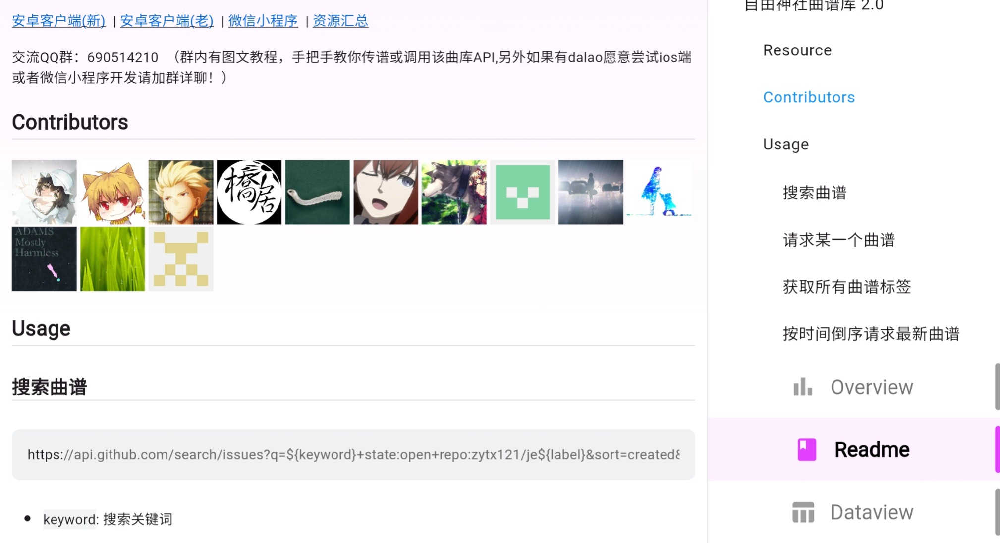
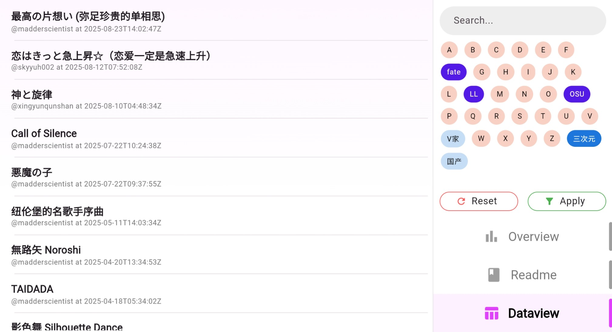
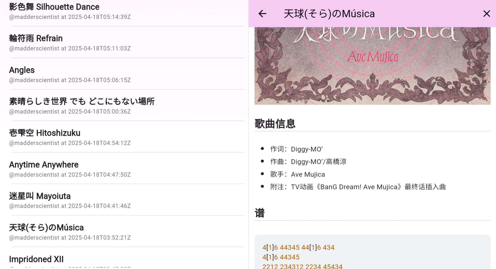
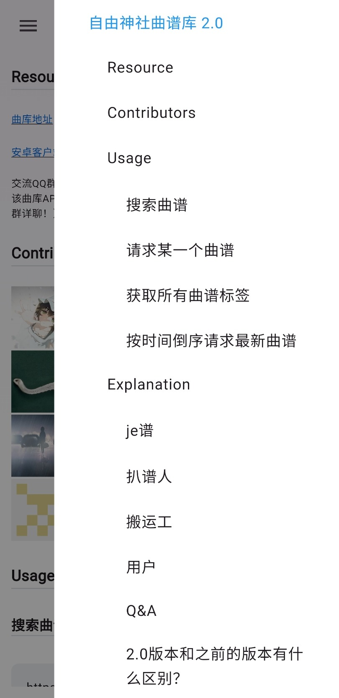
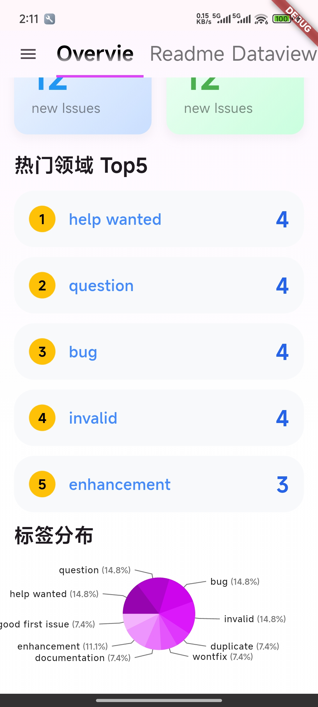

# GratisHub Issue Blog
利用 Github Issue 进行数据记录、利用 Github Pages 进行网页托管、[利用 Github Action 进行数据统计](https://github.com/madderscientist/issueStat)，简称——`GratisHub`：白嫖 GitHub ！

本项目力图实现[bga_issue_blog](https://github.com/bingoogolapple/bga_issue_blog)的效果，但更注重于数据的展示和浏览，更像一个数据展示框架。同样使用flutter，并进行了屏幕适配，支持Android、iOS、Web、Windows Desktop。

[DEMO](https://madderscientist.github.io/GratisHub_issue_blog/)

## 框架设计
主要功能是展示issue里面的内容。为此，本项目基本框架为：主页面和一个灵动的侧边栏。和常见的侧边栏不同的是，本项目的侧边栏设置在右侧，目的是为了让浏览issue内容时，左侧是list，右侧是具体内容，就像微信一样。再考虑到内容一般都是左对齐，为了避免这个宽度可变的“灵动侧栏”影响主区域的位置，设置在右侧也是合理的。

当用侧栏显示内容时，侧栏的宽度会加宽到屏幕的一半，进一步还可以全屏。其余时候，保持为窄窄的一条已经够用了：可以放个人信息、放目录、放搜索栏……这就是“灵动”所在。

当前页面展示的是：
1. issueStat项目的issue统计数据 + 我的github账号信息
2. JE曲谱库的readme + 目录
3. JE曲谱库的issue + 筛选/详情

<div style="overflow-x: auto; white-space: nowrap; padding: 8px 0;">
    
    
</div>
<div style="overflow-x: auto; white-space: nowrap; padding: 8px 0;">
    
    
</div>
<div style="overflow-x: auto; white-space: nowrap; padding: 8px 0;">
    
    
</div>

## 使用与发布
1. 安装依赖
    ```
    flutter pub get
    ```

2. 测试能不能跑起来（浏览器）
    ```
    flutter run -d chrome
    ```

3. 调整页面

    调哪里、怎么调：见下一章

4. 打包（以web为例）
    ```
    flutter build web
    ```

5. 发布到 GitHub Pages

    将上一步得到的`build/web`下的上传到一个开了Pages的Github仓库中即可

更多可以参考：[bga_issue_blog](https://github.com/bingoogolapple/bga_issue_blog)

## 文件结构与配置
```
./lib
│  common.dart  [不用管]一些定义和工具
│  config.dart  【要修改】默认展示的github仓库
│  github_request.dart  [不用管]github rest api 的封装，和怎么显示（issue、comment、label等）
│  hide_drawer.dart [不用管]竖屏时的侧栏
│  lazy_notifier.dart   [不用管]消息通知
│  long_press_copy.dart [不用管]侧栏展示issue详情时长按标题可以复制
│  main.dart    【可以不管】入口文件，有一些主题相关的全局设置。在这修改背景。
│  responsive_ui.dart   【最重要】有哪些页面、页面展示什么东西
│  scroll_center.dart   [不用管]区域不够时变为滚动
│  theme.dart   【可以不管】文字尺寸自适应屏幕大小，要修改文字大小就改这里
│
├─markdown_custom   [不用管]让markdown_widget支持更多东西
│      custom_node.dart
│      html_support.dart
│      svg.dart
│      video.dart
│
└─pages 【很重要】可以用的页面！
        dataview.dart   【超重要】issue列表和issue内容展示
        overview.dart   【很重要】利用issueStat进行的issue统计数据展示
        readme.dart     【很重要】README.md展示页面，稍微改改也能变为markdown展示页面
        user_side.dart  【很重要】侧栏的个人信息，可以丰富一下内容
```

所以——如果需要展示的内容和DEMO里面的一样，那只需要修改 [`responsive_ui.dart`](./lib/responsive_ui.dart) 里面的传参——就行啦！具体来说，修改 `pages` 变量。

如果想要进一步定制，需要有一定的flutter认知（结合AI也不难！）

想要更改Web的启动动画？直接改 [./web/index.html](./web/index.html)。

## 尚存在的问题
- SVG支持不足（是插件的问题）
- 没实现登录（以数据展示为目标貌似不需要）
- 请求不能太快（github有请求频率限制，一不小心就超限了。不过毕竟是白嫖嘛~）

## 开发相关
### UI架构
模型：子页面$P_i$的信息展示分为两部分: $A_i$和$B_i$。其中$A_i$是主页面；$B_i$是侧栏，根据$A_i$的操作决定其内容。为此制定了子页面的接口 [`SubPageWidget`](./lib/common.dart)。

父元素负责实现响应式布局，也就是A和B的位置会随着屏幕形状的改变而改变。父元素仅提供布局框架，即A和B部分的位置；而具体A和B的内容，则由子页面控制。

子元素用`indexedStack`组织，用`GlobalKey`保持状态。A和B采用不对等地位：切换到$P_i$时，首先让A布局显示$A_i$，然后根据$A_i$的状态会触发B布局显示$B_i$。于是，将$B_i$的渲染用函数的方式传递给父页面。

之所以是函数而不是Widget，是因为flutter的Widget是频繁重建的，所以要求每个子页面都提供B布局。而要状态共通（或者说消息传递），最好的方法是引用同一个，flutter中用ValueNotifier实现，于是封装了更自由的[`LazyNotifier`](./lib/lazy_notifier.dart)。

和B布局的build函数一起共享的，还有别的参数（见下），最终形成了 [`ResponseConfig`](lib/common.dart)。

### 屏幕适配
屏幕宽高比超过1时为横屏模式，否则为竖屏模式。

- 横屏模式

    右侧栏常驻，宽度为高度的1/3，内容分为上下两部分，上方为自定义内容，下方为导航栏。而显示具体issue内容时有以下不同：导航栏不能展示；宽度要增加。于是给`ResponseConfig`增加了“宽度比例”和“是否显示导航栏”

- 竖屏模式

    当竖屏时，导航栏变为顶部导航，且最左侧有一个按钮，点击可以呼出横屏时右侧栏的上半部分内容。呼出的内容作为右侧的弹出窗口层叠在页面上，宽度为屏幕宽度的0.9，高度为屏幕高度，宽度剩下的0.1要有阴影遮住后面。当显示issue内容时，直接占据整个屏幕，模拟新页面。手机版还需要适配返回动作：关闭侧边栏/退出详情页，于是给`ResponseConfig`增加了“close”回调，用于父页面关闭子页面。

- 横竖屏切换

    当显示issue详情的时候，横屏切换到竖屏要保持详情展示，即竖屏要全屏。这就是注释中的“重要内容”的含义。
